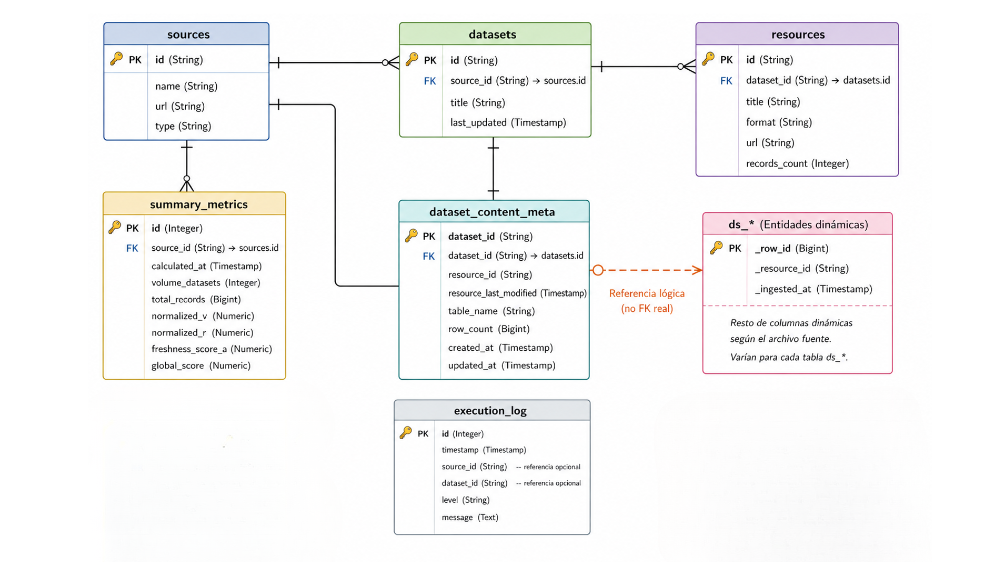

# Auditoría y Ranking de Datos Abiertos de Canarias

Este proyecto es un sistema hiperautomatizado construido en Python diseñado para auditar, puntuar y generar un informe de calidad sobre los portales de Datos Abiertos de la Comunidad Autónoma de Canarias (Gobierno, Cabildos y Ayuntamientos). 

Utiliza orquestación en contenedores y PostgreSQL para medir la *frescura*, *volatilidad* y cantidad de *registros* por cada conjunto de datos en base a las APIs de CKAN y otras fuentes de metadatos estandarizadas.

## Requisitos previos

- Docker y Docker Compose instalados (`sudo apt install docker-compose` o plugin de `docker compose`).
- (Opcional): Python 3.10+ para ejecución local.

## Puesta en marcha rápida (Docker Integrado)

1. **Configurar el entorno:**
   Copia el archivo de configuración de ejemplo y ajústalo si fuese necesario (especialmente útil configurar el `MAX_RECORDS_DOWNLOAD=1000` si quieres acotar la velocidad):
   ```bash
   cp .env.example .env
   ```

2. **Levantar todos los servicios:**
   Asegúrate de que el puerto `5432` de tu máquina esté disponible. Luego levanta tanto la base de datos como el pipeline:
   ```bash
   # Opción A (Para versiones de docker recientes):
   docker compose up -d db
   docker compose up app
   
   # Opción B (Si dispones del paquete antiguo docker-compose):
   docker-compose up -d db
   docker-compose up app
   ```

El archivo final auto-contenido aparecerá en la ruta `data/report.html`.

## Ejecución local sin el contenedor App

Si tu servicio de Docker se encuentra tras un firewall estricto o un error temporal de red te impide usar la imagen `python:slim`, puedes levantar únicamente la Base de Datos y ejecutar el pipeline localmente:

1. Levanta la Base de datos:
   ```bash
   docker compose up -d db
   ```
2. Instala dependencias y arranca el entorno:
   ```bash
   python3 -m venv venv
   source venv/bin/activate
   pip install -r requirements.txt
   ```
3. Ejecutar el código base:
   ```bash
   PYTHONPATH=. python src/main.py
   ```

## Resiliencia y Control de Ejecución
La aplicación está diseñada para retener el progreso (_checkpointing_). Si necesitas paralizar una descarga masiva (`Ctrl+C`), el sistema guardará su estado en el archivo `execution_state.json`.

Si deseas relanzar la recolección desde 0, primero debes vaciar este caché y resetear la Base de Datos:
```bash
docker compose down -v
rm -f execution_state.json
docker compose up -d db
```

---
 
## Esquema de la Base de Datos
 
### Tablas de metadatos (esquema fijo)
 
El sistema mantiene un conjunto de tablas con esquema fijo que almacenan la estructura organizativa de los datos y las métricas de calidad calculadas por el pipeline. Todas ellas son creadas automáticamente al arrancar la aplicación mediante `Base.metadata.create_all()` de SQLAlchemy.
 
#### `sources`
Registra cada portal de datos abiertos configurado en `config.py`. Es el punto de entrada de la jerarquía de datos.
 
| Columna | Tipo | Descripción |
|---|---|---|
| `id` | String (PK) | Identificador único de la fuente (ej. `elhierro`, `gobcan`) |
| `name` | String | Nombre legible del portal (ej. `Cabildo de El Hierro`) |
| `url` | String | URL base de la API CKAN |
| `type` | String | Tipo institucional: `Ayuntamiento`, `Cabildo` o `Especializado` |
 
#### `datasets`
Un dataset por cada conjunto de datos publicado en una fuente. Cada dataset puede tener uno o varios recursos asociados.
 
| Columna | Tipo | Descripción |
|---|---|---|
| `id` | String (PK) | Identificador CKAN del dataset |
| `source_id` | String (FK → sources) | Fuente a la que pertenece |
| `title` | String | Título del dataset |
| `last_updated` | DateTime | Fecha de última modificación de los metadatos del dataset |
 
#### `resources`
Cada recurso es un archivo o endpoint individual (CSV, JSON, XLS, PDF…) asociado a un dataset. Un dataset puede publicar el mismo dato en múltiples formatos.
 
| Columna | Tipo | Descripción |
|---|---|---|
| `id` | String (PK) | Identificador CKAN del recurso |
| `dataset_id` | String (FK → datasets) | Dataset al que pertenece |
| `title` | String | Nombre del recurso |
| `format` | String | Formato del archivo (`CSV`, `JSON`, `GEOJSON`, `XLS`, `XLSX`, etc.) |
| `url` | Text | URL de descarga directa |
| `records_count` | Integer | Número de registros contados en la última extracción |
 
#### `summary_metrics`
Almacena las métricas de calidad calculadas por la Fase 3 del pipeline para cada fuente. Se actualiza en cada ejecución completa.
 
| Columna | Tipo | Descripción |
|---|---|---|
| `id` | Integer (PK, autoincrement) | Identificador interno |
| `source_id` | String (FK → sources) | Fuente evaluada |
| `calculated_at` | DateTime | Timestamp del cálculo |
| `volume_datasets` | Integer | Número total de datasets de la fuente (V) |
| `total_records` | Integer | Suma de todos los registros de todos sus recursos (R) |
| `normalized_v` | Float | Volumen normalizado respecto al máximo del mismo tipo institucional (0–100) |
| `normalized_r` | Float | Registros normalizados igual que V (0–100) |
| `freshness_score_a` | Float | Puntuación de frescura ponderada por registros y antigüedad en días (0–100) |
| `global_score` | Float | Nota final: `0.3·V + 0.3·R + 0.4·A` |
 
#### `dataset_content_meta`
Tabla de control que registra qué datasets tienen tabla de contenido creada en la BD y en qué estado se encuentra. Permite al pipeline decidir en cada ejecución si debe crear, actualizar (append) o saltar la descarga de contenido de un dataset concreto.
 
| Columna | Tipo | Descripción |
|---|---|---|
| `dataset_id` | String (PK, FK → datasets) | Dataset al que corresponde |
| `resource_id` | String | ID del recurso que se usó para poblar la tabla |
| `resource_last_modified` | DateTime | Fecha de ese recurso en el momento de la última descarga |
| `table_name` | String | Nombre real de la tabla dinámica generada en la BD |
| `row_count` | Integer | Total de filas insertadas acumuladas |
| `created_at` | DateTime | Fecha de creación de la tabla de contenido |
| `updated_at` | DateTime | Fecha de la última actualización |
 
#### `execution_log`
Registro de errores ocurridos durante la ejecución del pipeline. Solo se insertan entradas cuando hay un fallo; una ejecución limpia no genera filas.
 
| Columna | Tipo | Descripción |
|---|---|---|
| `id` | Integer (PK, autoincrement) | Identificador interno |
| `timestamp` | DateTime | Momento del error |
| `source_id` | String | Fuente donde ocurrió (nullable) |
| `dataset_id` | String | Dataset implicado (nullable) |
| `level` | String | Nivel de severidad (actualmente siempre `ERROR`) |
| `message` | Text | Descripción del error |
 
---
 
### Tablas de contenido (esquema dinámico)
 
Por cada dataset que disponga de al menos un recurso en formato tabular (CSV, TSV, JSON, GeoJSON, XLS o XLSX), el pipeline crea automáticamente una tabla dedicada en la base de datos para almacenar su contenido completo.
 
#### Nomenclatura
 
El nombre de cada tabla se deriva del `dataset_id` del dataset aplicando la función `_safe_table_name()`, que realiza las siguientes transformaciones:
 
1. Convierte el ID a minúsculas.
2. Sustituye cualquier carácter no alfanumérico por `_`.
3. Colapsa guiones bajos consecutivos en uno solo.
4. Añade el prefijo `ds_` para distinguirlas visualmente de las tablas de metadatos.
5. Trunca el resultado a 63 caracteres (límite de PostgreSQL).
Por ejemplo, el dataset con ID `trafico-carreteras-2024` de la fuente `elhierro` generará una tabla llamada `ds_trafico_carreteras_2024`.
 
#### Columnas
 
Las columnas de cada tabla se generan dinámicamente a partir de las cabeceras del archivo descargado. Los nombres de columna se normalizan aplicando el mismo proceso que a los nombres de tabla (minúsculas, sin caracteres especiales, máximo 60 caracteres). Además, todas las tablas de contenido incluyen dos columnas de trazabilidad añadidas automáticamente:
 
| Columna | Tipo | Descripción |
|---|---|---|
| `_row_id` | Text (PK) | Índice de fila heredado del DataFrame de pandas |
| `_resource_id` | Text | ID del recurso CKAN del que procede la fila |
| `_ingested_at` | Text | Timestamp ISO 8601 del momento de la ingesta |
 
Todos los valores se almacenan como `Text` para maximizar la compatibilidad con cualquier tipo de dato que pueda contener el archivo original.
 
#### Lógica de actualización
 
El pipeline compara la fecha `last_modified` del recurso más reciente con la que figura en `dataset_content_meta` para decidir qué hacer en cada ejecución:
 
| Situación | Comportamiento |
|---|---|
| La tabla no existe aún | Se crea y se insertan todas las filas |
| La tabla existe y la fecha del recurso es la misma | Skip — no se descarga ni inserta nada |
| La tabla existe y el recurso tiene fecha más reciente | Se insertan las filas nuevas al final (append) |
| El recurso no tiene fecha (`last_modified` = null) y la tabla ya existe | Skip por seguridad — no es posible comparar versiones |
| Ningún recurso tiene fecha, pero la tabla no existe aún | Se usa el primer recurso tabular disponible como fallback |
 
#### Diagrama Entidad-Relación
 

 
---